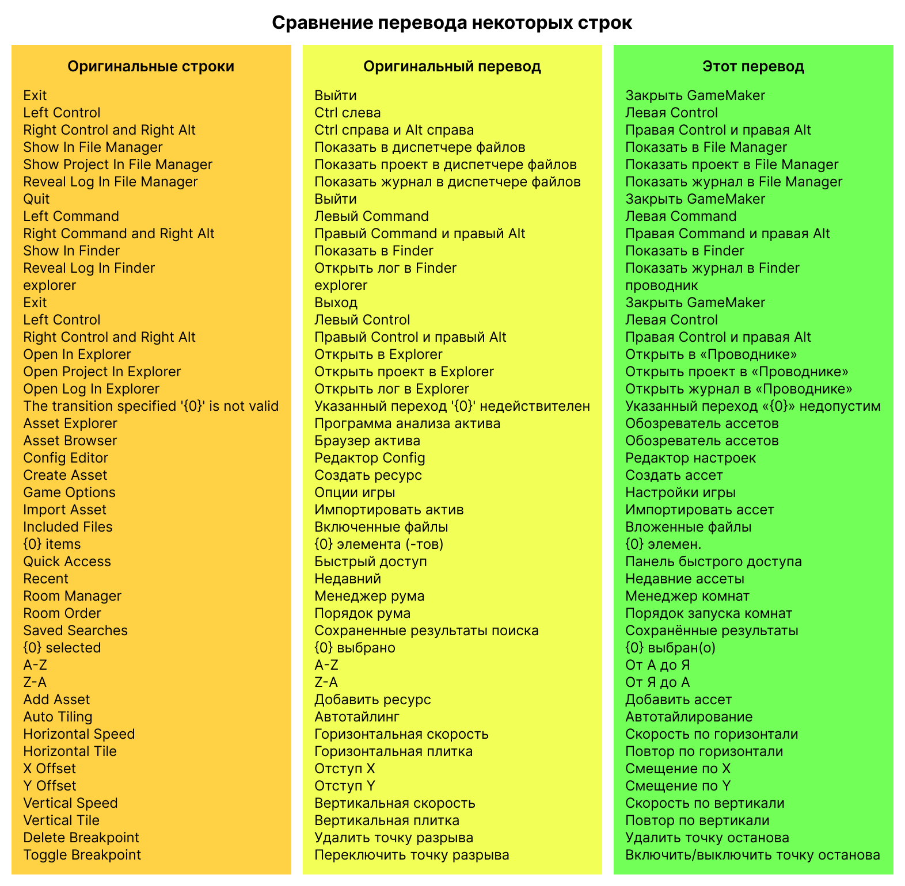

# Альтернативный русский язык для GameMaker

Улучшенная русская локализация GameMaker и некоторых статей руководства по нему в соответствии с личными предпочтениями.

Работа над этой локализацией ведётся на основе английской локализации, поэтому часть интерфейса пока что неизбежно остаётся на английском. Но это лучше, чем работать со встроенным русским переводом программы.

## Картинки

## Установка

1. Нажмите зелёную кнопку **`< > Code ▾`** над репозиторием.
2. Нажмите [**`Download ZIP`**](https://github.com/RushanM/GameMaker-Alt-Russian-Language/archive/refs/heads/main.zip) cнизу появившегося окна, чтобы скачать архив.
3. Откройте архив.
4. Закройте GameMaker, если он открыт.
5. Если вы хотите иметь возможность восстановить оригинальный русский перевод программы, сохраните папки Languages и Plugins из папки установки GameMaker куда-нибудь.
6. Переместите папки Language и Plugins из папки «Локализация» в архиве в папку вашей установки GameMaker с заменой.
7. Запустите GameMaker.
8. Установите русский язык в настройках, если он не был установлен.
9. Готово!
